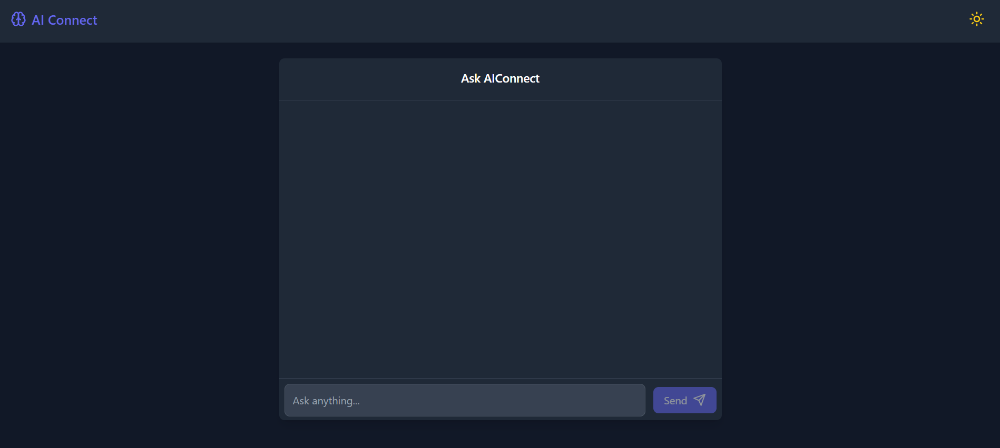

# AI Connect 🤖

<div align="center">
  

  

  

  
</div>

## ✨ Features

- 🎯 Real-time AI responses powered by Google's Gemini AI
- 🌓 Dark/Light mode support
- 💬 Interactive chat interface
- 📱 Fully responsive design
- 🚀 Fast and optimized performance
- 🎨 Clean and modern UI
- 📝 Markdown support in responses
- 🔄 Follow-up questions capability

## 🚀 Quick Start

### Prerequisites

- Node.js (v16 or higher)
- npm or yarn
- Google Gemini API key

### Installation

1. Clone the repository:
```bash
git clone https://github.com/pratham-prog861/ai-connect.git
cd ai-connect
```

2. Install dependencies:
```bash
    npm install
```

3. Set up environment variables:
```bash
    Create a .env file in the root directory and add your Google Gemini API key:

    REACT_APP_GEMINI_API_KEY=your-api-key
```

4. Start the development server:
```bash
    npm start
```


### 🛠️Tech Stack
----

    - Frontend Framework : React with TypeScript

    - Styling : TailwindCSS

    - AI Integration : Google Gemini AI

    - Routing : React Router

    - Build Tool : Vite

    - Icons : Lucide React

    - Markdown : React Markdown

----

### 📚 Project Structure

ai-connect/
├── src/
│   ├── components/
│   │   ├── ChatInterface.tsx
│   │   ├── AnswerDisplay.tsx
│   │   └── ThemeSwitcher.tsx
│   ├── services/
│   │   └── geminiService.ts
│   ├── App.tsx
│   └── main.tsx
├── public/
└── ...config files

----
### 🎯 Components 

    - ChatInterface : Main chat interface for user interactions

    - AnswerDisplay : Detailed view of AI responses with follow-up  capability

    - ThemeSwitcher : Dark/Light mode toggle component

    - GeminiService : AI integration service

----
### 🔨 Configuration

    - Environment variables:
        REACT_APP_GEMINI_API_KEY=your-api-key
----
## Deployment
    The project is configured for easy deployment on Netlify. Just connect your repository and:
        1. Set the build command: npm run build
        2. Set the publish directory: dist
        3. Add your environment variables in Netlify settings
----
### 🤝 Contributing
    Contributions are welcome! Please read the contributing guidelines for details.
    1. Fork the repository

    2. Create your feature branch ( git checkout -b feature/amazing-feature )

    3. Commit your changes ( git commit -m 'Add some amazing feature' )

    4. Push to the branch ( git push origin feature/amazing-feature )

    5. Open a Pull Request
---
### 📄 License
    This project is licensed under the MIT License - see the LICENSE file for details.
-----
### 🌟 Show your Support
    Give a ⭐️ if this project helped you! Your support means a lot!


------

Made my **Pratham Darji**